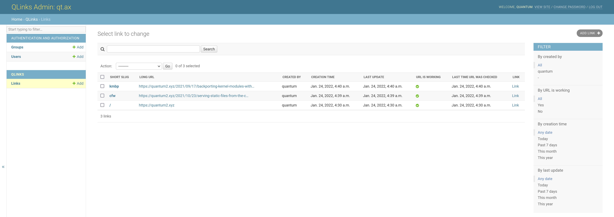

# QLinks
Self-hosted URL shortener with focus on link management for private use.

QLinks is not a normal URL shortener — it does not allow anyone on the Internet
to shorten any URLs and return some gibberish URL.
**QLinks is a tool to curate a collection of short links.**

## Features

* Automatically detect broken links;
* Support for CDN cache purging, allowing redirects to be cached at the edge
  (currently only Cloudflare is supported); and
* An amazing admin interface, powered by Django's admin site:
[](demo.png)

## Installation

```sh
git clone https://github.com/quantum5/qlinks.git
cd qlinks
python -m venv env --prompt qlinks
. env/bin/activate
pip install -r requirements.txt
cp qlinks/settings/template.py qlinks/settings/local.py
# Edit qlinks/settings/local.py to configure QLinks like a normal Django project.
python manage.py runserver
```

Once you are satisfied with the way QLinks works, load up
`qlinks.project.wsgi:application` in any WSGI-compliant application server.
